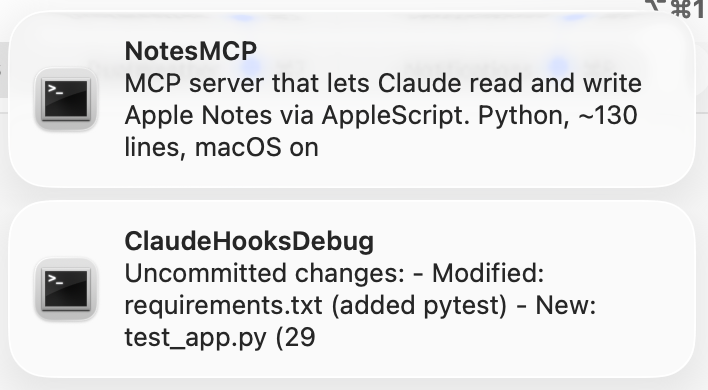

# macOS Claude Notifications

macOS notification hooks for [Claude Code](https://claude.ai/code). Get notified when Claude stops working or needs your input.



## Features

- macOS notifications via [terminal-notifier](https://github.com/julienXX/terminal-notifier)
- Notifications grouped by project for easy dismissal
- Auto-dismiss when Claude resumes work
- Extracts actual question text from AskUserQuestion prompts
- Optional JSON logging for troubleshooting

## Installation

1. Install dependencies:
   ```bash
   brew install terminal-notifier jq
   ```

2. Clone the repository:
   ```bash
   git clone https://github.com/nickholub/macos-claude-notifications.git
   ```

3. Configure hooks in `~/.claude/settings.json` using absolute paths to the repo:
   ```json
   {
     "hooks": {
       "PreToolUse": [
         {
           "hooks": [
             {
               "type": "command",
               "command": "/path/to/macos-claude-notifications/hooks/notifications_dismiss.sh",
               "async": true
             }
           ]
         },
         {
           "matcher": "AskUserQuestion",
           "hooks": [
             {
               "type": "command",
               "command": "/path/to/macos-claude-notifications/hooks/notify.sh",
               "async": true
             }
           ]
         }
       ],
       "Stop": [
         {
           "hooks": [
             {
               "type": "command",
               "command": "/path/to/macos-claude-notifications/hooks/notify.sh",
               "async": true
             }
           ]
         }
       ],
       "Notification": [
         {
           "matcher": "permission_prompt",
           "hooks": [
             {
               "type": "command",
               "command": "/path/to/macos-claude-notifications/hooks/notify.sh",
               "async": true
             }
           ]
         }
       ]
     }
   }
   ```

   Replace `/path/to/macos-claude-notifications` with your actual clone location.

4. (Optional) Enable persistent notifications:

   By default, macOS uses temporary banner notifications that disappear after a few seconds. To keep notifications visible until you dismiss them, open **System Settings** > **Notifications** > **terminal-notifier** and set **Alert Style** to **Persistent**.

   

   Notifications will auto-dismiss after 60 seconds of inactivity (no new notifications in the same project group).

## How It Works

### Notification Format

- **Title**: Project name (from directory)
- **Message**: Task summary or question text

### Hook Behavior

- **Stop hook**: Shows notification with task summary extracted from transcript
- **AskUserQuestion hook**: Shows notification with the actual question Claude is asking
- **Notification hook**: Shows notification when Claude needs permission approval
- **PreToolUse hook**: Dismisses previous notifications when Claude resumes work

Notifications are grouped by project name, so dismissing one clears all notifications for that project.

## Logging

To enable JSON history logging, pass the `--log-json` flag to `notify.sh`:
```
/path/to/macos-claude-notifications/hooks/notify.sh --log-json
```
This will append each hook's JSON input to `/tmp/claude-hook-YYYY-MM-DD.json`.

## Development

### Testing

Tests use [bats-core](https://github.com/bats-core/bats-core):

```bash
brew install bats-core
bats tests/
```
